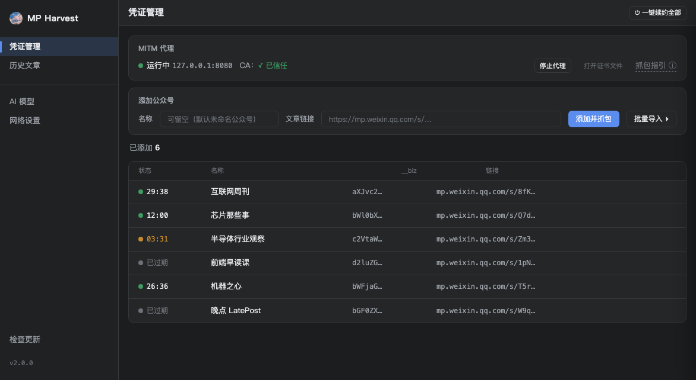
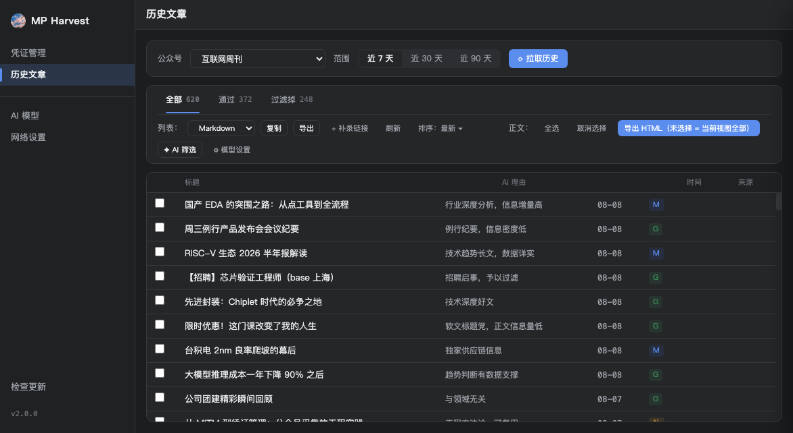
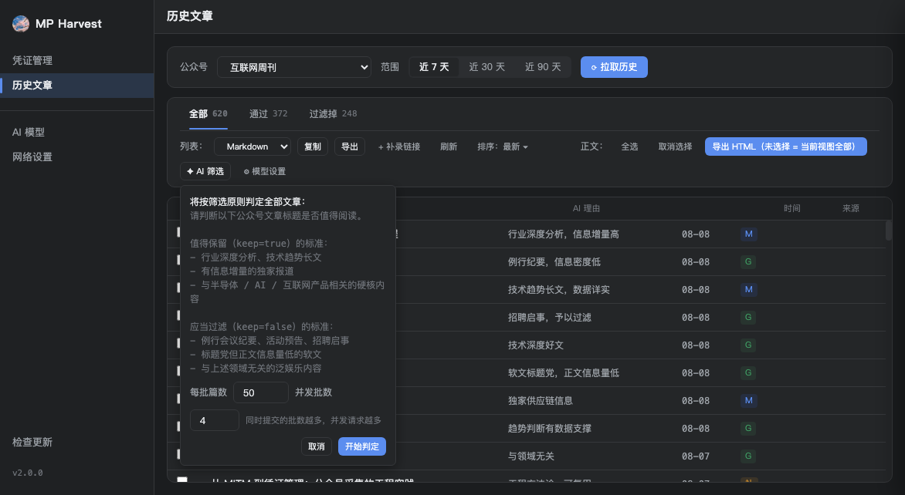
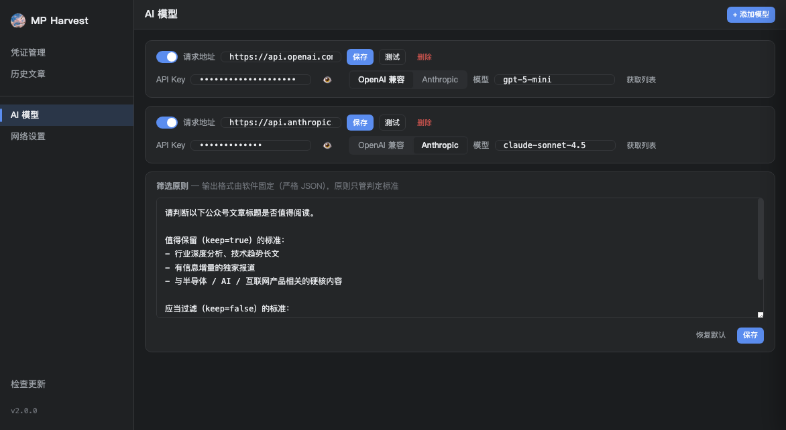
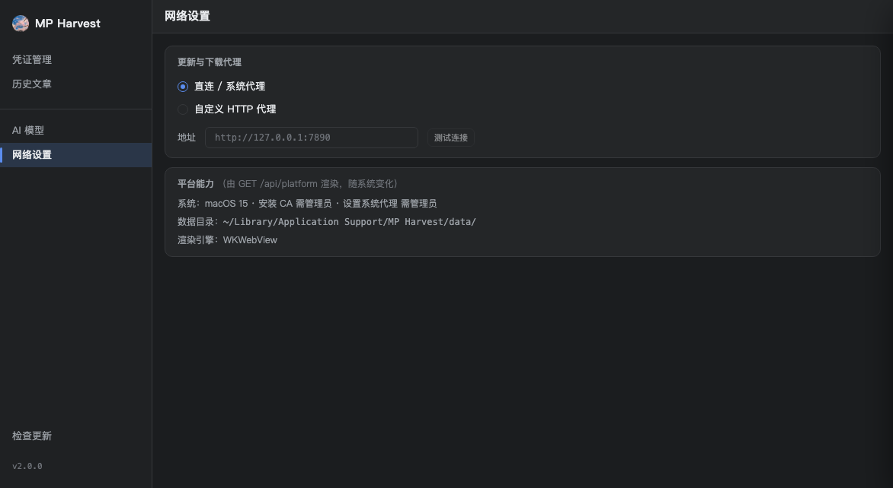

# MP Harvest 2.0 使用手册

> 公众号凭证捕获与历史文章工具（macOS / Windows）。本文档从「下载代码」讲到最后「用 AI 筛选文章」，所有截图均为演示数据（`?mock=1`），不含任何真实凭证。

---

## 目录

1. [这是什么](#1-这是什么)
2. [下载代码](#2-下载代码)
3. [环境要求与依赖](#3-环境要求与依赖)
4. [安装步骤](#4-安装步骤)
5. [启动软件](#5-启动软件)
6. [首次使用：抓取公众号凭证](#6-首次使用抓取公众号凭证)
7. [界面说明](#7-界面说明)
8. [系统代理与安全注意事项](#8-系统代理与安全注意事项)
9. [数据目录与备份](#9-数据目录与备份)
10. [常见问题（FAQ）](#10-常见问题faq)
11. [开发者附录](#11-开发者附录)

---

## 1. 这是什么

MP Harvest 是微信公众号凭证捕获与历史文章管理工具：

- **抓凭证**：在微信桌面版打开公众号文章，自动捕获请求中的 `__biz / uin / key / pass_ticket / appmsg_token`，绑定到账号后 **30 分钟有效**，可一键续约；
- **拉历史**：按近 7 / 30 / 90 天拉取公众号历史文章（500+ 篇也能流畅滚动）；
- **AI 筛选**：调用你配置的大模型（DeepSeek、OpenAI 兼容接口等），按筛选原则给每篇文章打「保留 / 过滤」标签；
- **导出**：列表导出（Markdown / JSON / CSV / TSV / 纯链接 / 标题+链接）与 HTML 正文导出。

> **致谢**：本项目（独立开发，macOS/Windows 跨平台重构）的核心业务逻辑脱胎于早期的
> Windows 版 `schinza-wechat-certificate` 工具（原作者 [Alexxxxxxxxxxxxy](https://github.com/Alexxxxxxxxxxxxy/schinza-wechat-certificate)），在此致谢；
> 界面、服务层与平台适配均为本项目独立实现。

---

## 2. 下载代码

把整个项目下载到**任意目录**都可以直接运行（已做路径无关化处理）：

```bash
# 方式一：Git 克隆
git clone https://github.com/shirainbown/mp-harvest.git

# 方式二：下载 ZIP 并解压
```

下载后确认目录结构里有 `run.py`（启动器）和 `mp_harvest/` 目录即可。**不需要**放到固定位置，也不需要管理员权限安装。

> **不想装 Python/Node 的普通用户**：直接下载发布版
> [MP Harvest v2.0.0（macOS）](https://github.com/shirainbown/mp-harvest/releases/tag/v2.0.0)
> 的 **`MP-Harvest-mac-2.0.0.dmg`**（推荐）：双击打开，把 `MP Harvest.app` 拖入「应用程序」即可
> （`MP-Harvest-mac-2.0.0.zip` 供应用内自动更新使用；当前仅 Apple Silicon；
> 未签名版本首次打开会提示「无法验证开发者」：**右键点击应用 → 打开 → 再点「打开」**，
> 或到「系统设置 → 隐私与安全性 → 仍要打开」放行一次；有管理员权限也可执行
> `sudo xattr -cr "/Applications/MP Harvest.app"`）。

---

## 3. 环境要求与依赖

### 3.1 硬件与系统

| 项目 | 要求 |
|---|---|
| 操作系统 | macOS（当前开发验证平台）或 Windows（目标支持） |
| 内存 / 磁盘 | 2 GB 内存、500 MB 磁盘即可（500+ 文章虚拟滚动不吃资源） |
| 微信 | **微信桌面版**（抓包目标，必须本机安装并登录） |

### 3.2 软件依赖

| 依赖 | 版本 | 必须？ | 用途 |
|---|---|---|---|
| Python | **3.13** | ✅ 必须 | 运行后端、抓包、CA 管理 |
| uv 或 pip | 任意较新版本 | ✅ 必须（二选一） | 创建虚拟环境、安装依赖 |
| Node.js + npm | 18+ | ⚠️ 首次运行前端缺失时 | 自动/手动构建前端界面（已有 `dist` 则不需要） |
| 大模型 API Key | DeepSeek / OpenAI 兼容 | 可选 | AI 筛选功能 |
| 网络 | 可访问微信、GitHub（更新）、模型 API | ✅ | — |

> 说明：`frontend/dist` 是构建产物、默认不进仓库；第一次运行 `run.py` 会自动执行
> `npm install && npm run build`（需要 Node.js）。如果你只想先看界面，也可以跳过 Node，
> 但界面会显示“构建提示”而不是图形界面。

---

## 4. 安装步骤

### 步骤 1：安装 Python 3.13

macOS 推荐用 [Homebrew](https://brew.sh)：

```bash
brew install python@3.13
```

Windows 到 [python.org](https://www.python.org/downloads/) 下载 3.13 安装包，勾选 “Add to PATH”。

### 步骤 2：创建虚拟环境并安装依赖

在项目根目录执行（推荐 uv，也可以用 pip）：

```bash
# 方式 A：uv（推荐，更快）
uv venv .venv --python 3.13
uv pip install -r requirements.txt

# 方式 B：pip
python3.13 -m venv .venv
.venv/bin/python -m pip install -r requirements.txt   # Windows: .venv\Scripts\python -m pip install -r requirements.txt
```

`requirements.txt` 同时包含 core 与 server 所需依赖（mitmproxy、fastapi、uvicorn、pywebview 等），一条命令装完。

### 步骤 3：前端构建（可选，首次运行时也会自动做）

```bash
cd mp_harvest/frontend
npm install
npm run build
cd ../..
```

构建成功会在 `mp_harvest/frontend/dist/` 生成界面文件。

### 步骤 4：验证安装

```bash
.venv/bin/python run.py --no-window
```

看到终端打印 `[mp_harvest] 服务已启动：http://127.0.0.1:xxxxx/?token=...` 即安装成功（`Ctrl+C` 退出）。

---

## 5. 启动软件

在**任意目录**都能启动（`run.py` 会自动定位项目根）：

```bash
# 推荐：生产模式，打开图形窗口
python run.py

# 仅启动服务，用浏览器打开终端打印的 URL（适合调试）
python run.py --no-window

# 前端热更新开发模式（需要先启动 Vite）
python run.py --dev http://localhost:5173
```

> Windows 下用 `.venv\Scripts\python run.py`。

启动成功的标志：弹出 MP Harvest 窗口，默认显示「凭证管理」页。

---

## 6. 首次使用：抓取公众号凭证

核心链路：**添加公众号 → 安装 CA → 启动抓包 → 微信刷新文章 → 凭证倒计时**。

### 6.1 添加公众号

在「凭证管理」页右侧填写：

- **名称**：可留空（默认显示「未命名公众号」）；
- **文章链接**：必填，必须是 `https://mp.weixin.qq.com/...` 的公众号文章链接（带 `__biz` 参数最佳）。

点「添加并抓包」。此时应用会自动启动抓包代理（系统代理临时切到 `127.0.0.1:8088`）。

### 6.2 安装并信任 CA 证书

首次抓 https 需要信任应用的根证书：

1. 点凭证页「安装 CA 证书」；
2. macOS 会弹出系统授权框，输入**管理员密码**；
3. 状态变为「CA：已信任」即成功。

> 证书生成在 `mp_harvest/data/mitm_conf/`（开发模式）。如果删除过数据目录，需要重新安装一次。

### 6.3 微信桌面版刷新文章

打开**微信桌面版**，进入刚才那个公众号，点开一篇文章（或下拉刷新消息列表）。应用会在后台捕获微信请求中的凭证。

### 6.4 确认捕获成功

回到凭证页：账号状态变为**「有效 · 29:xx」倒计时**即成功（30 分钟有效）。可以点「复制凭证」查看 JSON。

### 6.5 续约

凭证过期后：

1. 点账号右侧「续约」（或顶部「一键续约全部」）；
2. 再回微信刷新一次文章；
3. 凭证页倒计时恢复 → 续约完成。

### 6.6 停止抓包

点「停止抓包」（或直接退出应用），系统代理会自动恢复为你原来的设置（包括你已有的 Clash 代理）。

---

## 7. 界面说明

### 7.1 凭证管理



- **MITM 代理**：抓包开关与端口状态；
- **CA 状态**：证书是否已信任；
- **添加公众号**：名称（可空）+ 文章链接；
- **账号列表**：状态（等待抓包 / 有效 + 倒计时 / 已过期）、复制凭证、续约、删除；
- **一键续约全部**：批量重置等待抓包。

### 7.2 历史文章



- 顶部选择公众号与拉取范围（近 7 / 30 / 90 天），点「拉取历史」；
- 视图切换：全部 / 通过 / 过滤；支持复制、导出列表；
- 列表为虚拟滚动，500+ 条流畅；
- 「+ 补录链接」手动补录；
- 「✦ AI 筛选」：按筛选原则判定全部文章。

#### AI 筛选参数（每批 / 并发）



- **每批篇数**：每批交给模型的文章标题数（默认 50）；
- **并发批数**：同时提交的批数（越大并发越高，注意模型限流）；
- 每完成一批，列表会**实时刷新**判定结果（通过/过滤标记、计数即时变化），不用等全部跑完。

### 7.3 AI 模型



每个模型卡片包含：

- **启用开关** + **请求地址**（如 `https://api.deepseek.com`）；
- **API Key**（密码框显示，眼睛图标可查看）；
- **格式**：OpenAI 兼容 / Anthropic；
- **模型**：可手输，也可点「获取列表」从接口拉取后选择（一个组合框，输入选择两不误）；
- **测试**：发一条最小消息验证连通性；
- **保存**：改完手动点保存（不会自动保存）；
- 下方「筛选原则」：只影响判定标准，输出格式由软件固定为严格 JSON。

### 7.4 网络设置



- **更新与下载代理**：只用于「检查更新 / 下载更新包」时走哪个代理；
  - 直连 / 系统代理 = 跟随系统默认网络；
  - 自定义 HTTP 代理 = 强制走你填的地址；
  - 它**不影响**抓包（8088）、不影响 AI 请求、不影响微信捕获；
- **平台能力**：当前系统的数据目录、CA/代理权限、渲染引擎等只读信息。

---

## 8. 系统代理与安全注意事项

⚠️ 请务必阅读，这关系到你的网络稳定与隐私：

1. **抓包期间整机系统代理会临时切到 `127.0.0.1:8088`**，停止抓包/正常退出会自动恢复原设置（含你已有的 Clash 7897 等）。
2. **抓包期间不要登录银行、邮箱等敏感网站**：https 流量会经过本地代理与自签证书。
3. **抓包期间不要依赖本机 Codex / 其他 AI 助手在线**：它们走系统代理，会被一起吸入抓包代理导致「正在重新连接」；抓包请用短窗口（启动 → 微信刷新 → 凭证绑定 → 立即停止）。
4. 应用**异常退出**可能残留 8088 代理，恢复命令：

   ```bash
   networksetup -listallnetworkservices | while read s; do [ "${s#\*}" = "$s" ] || continue; networksetup -setwebproxystate "$s" off; networksetup -setsecurewebproxystate "$s" off; done
   ```

   （注意：该命令会关闭所有服务的代理，含你原来的 Clash，需要的话再手动开。）
5. 与 Clash Verge 共存：Clash 开着「系统代理」开关时会不停把代理写回 7897，属正常环境行为，不是本软件 bug。

---

## 9. 数据目录与备份

数据目录是**固定位置、持久保存**的（不是每次启动重建）：

| 运行模式 | 数据目录 |
|---|---|
| 开发模式（当前） | `<项目>/mp_harvest/data/` |
| 打包版 macOS | `~/Library/Application Support/MP Harvest/data/` |
| 打包版 Windows | `%APPDATA%\MP Harvest\data\` |

里面保存：`accounts.json`（**含微信凭证**）、`ai_models.json`（**含 API Key**）、`ai_principles.txt`、目击记录、CA 证书等。

- **备份 = 复制整个 `data/` 目录**；
- 目录被删掉后会自动重建，但会生成**新 CA**，需要重新安装信任，且旧凭证、模型配置丢失；
- 该目录已在 `.gitignore` 中，**不要**提交到仓库或发给他人。

---

## 10. 常见问题（FAQ）

**Q1：界面是文字提示「frontend/dist 不存在」？**
前端未构建。首次运行会自动构建（需 Node.js）；或手动执行 `cd mp_harvest/frontend && npm install && npm run build`。

**Q2：AI 模型「测试」失败？**
检查：请求地址（`https://api.deepseek.com`）、API Key、模型名（可用「获取列表」拉取）。DeepSeek 对 JSON 输出有“prompt 必须含 json”的要求，应用会自动去掉 `response_format` 重试一次，属正常。

**Q3：一直显示「抓包中」？**
确认：CA 已信任 → 启动抓包 → 微信桌面版**真的打开/刷新了文章**。凭证页出现倒计时即成功。若仍不行，看终端日志是否有 `[mp_harvest-capture] hit`。

**Q4：为什么用着用着本机 Codex 显示「正在重新连接」？**
抓包把系统代理切到了 8088，本机 AI 助手的连接也被吸入且不信任抓包证书。**停止抓包/退出应用**即可恢复；详见 §8。

**Q5：更新下载失败？**
检查「网络设置」里的更新代理（国内网络访问 GitHub 建议配代理），或确认网络可达 GitHub。

**Q6：在 Windows 上能跑吗？**
代码目标跨平台（CA/代理/路径均有 Windows 适配），打包版待 M5 验证；当前在 macOS 上完成真机验证。

**Q7：凭证为什么 30 分钟就过期？**
微信接口凭证有效期约 30 分钟，过期后点「续约」再刷新微信文章即可，无需重新添加。

---

## 11. 开发者附录

```bash
# core 业务测试（零依赖 runner）
.venv/bin/python mp_harvest/tests/run_tests.py

# server 契约测试
.venv/bin/python -m pytest mp_harvest/tests/server -q

# 前端类型检查 + 构建
cd mp_harvest/frontend && npm run build
```

开发文档：`docs/API.md`（接口契约）、`docs/PROGRESS.md`（进度）、`docs/KANBAN.md`（任务）、`docs/TEST_RECORD.md`（测试记录与事故）、`docs/USAGE_NOTES.md`（使用注意事项）。修改代码后请同步更新对应文档。
